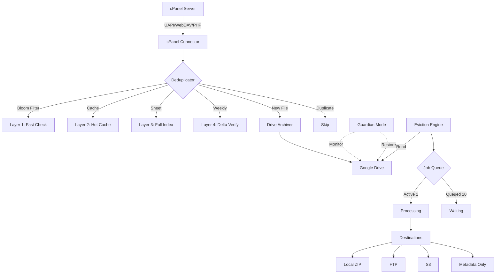

<div dir="rtl">

# 🗄️ cPanel-to-Google-Drive Archiver

> **نظام أرشفة ذكي متكامل** لنقل الملفات من خادم cPanel إلى Google Drive
> مع حماية متقدمة، كشف تكرار عالي الأداء، وتفريغ انتقائي بواسطة Job Queue.

</div>

<div align="center">


**[العربية](#-نظرة-عامة) • [English](#-overview) • [Documentation](docs/) • [Contributing](CONTRIBUTING.md)**

</div>

---

<div dir="rtl">

## 📋 نظرة عامة

نظام أرشفة احترافي مبني على **Google Apps Script** لأتمتة نقل الملفات من خادم **cPanel** إلى **Google Drive** مع الحفاظ على الهيكل الشجري والتصنيفات الأصلية.

### 🎯 لماذا هذا النظام؟

- 🚀 **أداء فائق** — كشف تكرار بسرعة `O(1)` عبر Bloom Filter + Hot Cache.
- 🛡️ **حماية متعددة الطبقات** — Guardian Mode مع Auto-Restore من Drive Trash.
- 🗂️ **تفريغ ذكي** — Job Queue لإدارة عمليات التفريغ الضخمة دون تجاوز حدود Apps Script.
- 🌐 **دعم متعدد الطرق** — cPanel UAPI, WebDAV, PHP Bridge.
- 📊 **تقارير شاملة** — يومية، أسبوعية، وتنبيهات فورية بالبريد.
- 🎨 **واجهة عربية** — RTL كامل بـ Material Design 3.

---

## ✨ المميزات الرئيسية

### 🔗 الاتصال بـ cPanel
- ✅ 3 طرق اتصال (UAPI / WebDAV / PHP Bridge) قابلة للتبديل.
- ✅ دعم Streaming/Chunked Download للملفات الكبيرة.
- ✅ تحقق SHA-256 قبل الحذف من المصدر.
- ✅ Rate Limiting ذكي.

### 🧠 كشف التكرار الذكي (Smart Deduplication)
نظام هجين متعدد الطبقات لأعلى أداء:

```
Layer 1: Bloom Filter (100,000 files, ~1.2KB memory)
Layer 2: Hot Cache (72 ساعة قابلة للتخصيص)
Layer 3: Full Index (Google Sheet دائم)
Layer 4: Weekly Delta Verification (5% عشوائياً)
```

**النتيجة:** فحص 500 ملف في < 2 ثانية بدلاً من 100 ثانية.

### 🛡️ Guardian Mode (وضع الحارس)
- 🔒 **Delayed Deletion** — انتظار قابل للتخصيص (72 ساعة افتراضياً).
- 👁️ **Trash Monitoring** — فحص يومي لسلة محذوفات Drive.
- 🔄 **Auto-Restore** — استعادة تلقائية عند اكتشاف حذف يدوي.
- 🔐 **Delete Lock** — منع الحذف اليدوي عبر Drive Permissions.
- 📝 **Audit Trail** — سجل تدقيق كامل.
- ⏸️ **Emergency Freeze** — إيقاف طارئ من الواجهة.

### 🗂️ نظام Vault Migration (التفريغ الانتقائي)
- 🌳 **شجرة مجلدات تفاعلية** مع Lazy Loading.
- 📊 **إحصائيات فورية** لكل مجلد (حجم، عدد، آخر تحديث).
- 🎯 **4 وجهات تفريغ**: Local, FTP, S3, Metadata Only.
- 📦 **استراتيجيات تلقائية** حسب الحجم:
  - < 2 GB → Single ZIP
  - 2-10 GB → Chunked ZIPs (500MB/جزء)
  - \> 10 GB → Sequential Files
- 🚦 **Job Queue** — 1 نشط + 10 في الطابور.
- 🔍 **Preview Mode** — معاينة قبل التنفيذ.
- 📄 **Manifest متطور** — لكل عملية تفريغ.

### 📅 الجدولة والأتمتة
- ⏰ Triggers ديناميكية (كل ساعة/يومي/أسبوعي/Cron).
- 🔒 Lock Service لمنع التوازي.
- ✅ Checkpointing لاستئناف المهام الطويلة.
- 🔁 Exponential Backoff Retry.
- ⚡ Circuit Breaker.

### 📧 نظام الإشعارات
- 📮 **تقارير يومية** HTML بـ RTL.
- 🚨 **تنبيهات فورية** عند الفشل.
- 📊 **تقارير أسبوعية** بالإحصائيات والاتجاهات.
- 🔔 **Web Push** اختياري.
- 💬 **WhatsApp** اختياري.

### 🎨 واجهة الإعدادات
- 🌐 دعم كامل للـ **RTL العربي**.
- 🎨 **Material Design 3**.
- 📑 **10 تبويبات منظمة** لكل المميزات.
- 🌙 **Dark/Light Mode**.
- 🔐 تشفير AES-256 للبيانات الحساسة.

---

## 🏗️ المعمارية



---

## 🚀 البدء السريع

### المتطلبات الأساسية

- Node.js `>= 18.0.0`
- npm `>= 9.0.0`
- حساب Google (Gmail أو Workspace)
- خادم cPanel مع صلاحيات مناسبة
- خبرة بسيطة بـ Terminal

### التثبيت

</div>

```bash
# 1. Clone the repository
git clone https://github.com/YOUR_USERNAME/cpanel-drive-archiver.git
cd cpanel-drive-archiver

# 2. Install clasp globally
npm install -g @google/clasp

# 3. Login to Google
clasp login

# 4. Enable Apps Script API (open in browser)
# https://script.google.com/home/usersettings

# 5. Create the project on Apps Script
clasp create --type webapp --title "cPanel-Drive-Archiver"

# 6. Push code to Apps Script
clasp push

# 7. Open the project in browser
clasp open
```

<div dir="rtl">

للتفاصيل الكاملة، راجع [دليل النشر](docs/DEPLOYMENT.md).

---

## 📁 هيكل المشروع

</div>

```
cpanel-drive-archiver/
├── 📄 CLAUDE.md                    # مواصفات المشروع الكاملة
├── 📄 README.md                    # هذا الملف
├── 📄 appsscript.json              # Manifest المشروع
├── 📁 src/
│   ├── Main.js                    # نقطة الدخول
│   ├── Config.js                  # الإعدادات
│   ├── cpanel/                    # وحدات cPanel
│   ├── drive/                     # وحدات Drive
│   ├── dedup/                     # نظام التكرار
│   ├── guardian/                  # Guardian Mode
│   ├── eviction/                  # نظام التفريغ
│   ├── scheduler/                 # الجدولة
│   ├── logger/                    # السجلات
│   ├── notifier/                  # الإشعارات
│   └── api/                       # Companion API
├── 📁 ui/                         # واجهات HTML
├── 📁 tests/                      # الاختبارات
└── 📁 docs/                       # التوثيق
```

<div dir="rtl">

---

## 📊 لوحات التحكم

### لوحة الإحصائيات الرئيسية
- 📈 عرض إجمالي الملفات المؤرشفة.
- 💾 استخدام مساحة Drive.
- ⚡ سرعة الأرشفة اليومية.
- 🎯 معدل النجاح.

### لوحة Job Queue
- 🟢 الجلسة النشطة مع نسبة التقدم.
- 🟡 الطابور والأولويات.
- ✅ آخر العمليات المكتملة.
- ❌ الفاشلة القابلة لإعادة المحاولة.

### مستكشف المجلدات (Folder Explorer)
- 🌳 شجرة تفاعلية.
- 🎨 تلوين حسب الحجم.
- 🔍 بحث سريع.
- 📊 إحصائيات فورية.

---

## ⚙️ الإعدادات

النظام يوفر واجهة إعدادات كاملة بـ **10 تبويبات**:

| التبويب | المحتوى |
|---|---|
| ⚙️ عام | اللغة، التوقيت، الحالة |
| 🔗 cPanel | طريقة الاتصال، بيانات الخادم |
| 📁 Drive | المجلد الرئيسي، الصلاحيات |
| 🧠 التكرار | Bloom Filter, Hot Cache, Delta |
| 🛡️ Guardian | الحماية والاستعادة |
| 🗂️ التفريغ | الوجهات، الاستراتيجيات، التحقق |
| 📅 الجدولة | Triggers, Retry, Circuit Breaker |
| 📧 الإشعارات | البريد، الأنواع، القنوات |
| 📊 التقارير | الأوراق والإحصائيات |
| 🔧 متقدم | API، Debug، Reset |

---

## 🔒 الأمان

### الممارسات المُطبّقة
- ✅ تشفير **AES-256** لكل البيانات الحساسة.
- ✅ **مبدأ أقل الامتيازات** في Scopes.
- ✅ **CSRF Protection** لكل النماذج.
- ✅ **Rate Limiting** على API endpoints.
- ✅ **Sanitization** لكل المدخلات.
- ✅ **Audit Logging** كامل.
- ✅ **لا** تخزين كلمات مرور كنص صريح.

### الإبلاغ عن ثغرة
إذا اكتشفت ثغرة أمنية، **لا** تنشرها علناً. راسلنا مباشرةً عبر البريد.

---

## 📊 حدود Google Apps Script

النظام مُصمَّم للعمل ضمن هذه القيود:

| المورد | الحد | كيف نتعامل معه |
|---|---|---|
| Execution Time | 6-30 دقيقة | Checkpointing + Auto-resume |
| Blob Size | 50 MB | Streaming + Chunked |
| URL Fetch | 20,000/يوم | Rate Limiting + Batching |
| Triggers | 20/script | إدارة ديناميكية |
| Runtime | لا Multi-threading | Job Queue |

---

## 🧪 الاختبار

</div>

```bash
# Run all tests
clasp run runAllTests

# Run specific test suite
clasp run testBloomFilter
clasp run testDeduplicator
clasp run testEvictionEngine

# View logs
clasp logs
```

<div dir="rtl">

---

## 📚 التوثيق

- 📖 [دليل النشر](docs/DEPLOYMENT.md) — خطوات التنصيب الكاملة.
- 🔧 [إعداد cPanel](docs/CPANEL_SETUP.md) — تجهيز الخادم.
- 🐛 [استكشاف الأخطاء](docs/TROUBLESHOOTING.md) — الحلول للمشاكل الشائعة.
- 🔌 [مرجع API](docs/API_REFERENCE.md) — للـ Companion Desktop App.
- 🔐 [الأمان](docs/SECURITY.md) — أفضل الممارسات.
- 📐 [المعمارية](ARCHITECTURE.md) — تفاصيل تقنية.

---

## 🗺️ خارطة الطريق (Roadmap)

### ✅ المرحلة 1 (الحالية)
- [x] المواصفات الكاملة (CLAUDE.md)
- [ ] نظام الاتصال بـ cPanel
- [ ] Smart Deduplication System
- [ ] Guardian Mode
- [ ] Vault Migration مع Job Queue
- [ ] واجهة الإعدادات RTL
- [ ] نظام الإشعارات

### 🔜 المرحلة 2 (المستقبل)
- [ ] Companion Desktop App (Electron)
- [ ] دعم تخزين إضافي (OneDrive, Dropbox)
- [ ] AI-based classification للملفات
- [ ] Advanced analytics dashboard
- [ ] Mobile app للمراقبة

---

## 🤝 المساهمة

المساهمات مرحّب بها! راجع [دليل المساهمة](CONTRIBUTING.md) للتفاصيل.

### كيف تساهم؟
1. **Fork** المستودع.
2. أنشئ فرعاً جديداً: `git checkout -b feature/amazing-feature`.
3. Commit تغييراتك: `git commit -m 'Add amazing feature'`.
4. Push للفرع: `git push origin feature/amazing-feature`.
5. افتح **Pull Request**.

---

## 🐛 الإبلاغ عن الأخطاء

- استخدم [GitHub Issues](../../issues).
- ضمّن: التوقعات، الفعلي، خطوات إعادة الإنتاج، السجلات.
- تحقق أولاً أن المشكلة غير مبلَّغ عنها.

---

## 📄 الترخيص

هذا المشروع مرخّص تحت **رخصة MIT** — راجع ملف [LICENSE](LICENSE) للتفاصيل.

---

## 🙏 شكر خاص

- **Google Apps Script Team** على المنصة الرائعة.
- **Anthropic Claude** على المساعدة في التطوير.
- **مجتمع Apps Script العربي**.

---

## 📞 التواصل

- 🌐 **GitHub:** [YOUR_USERNAME](https://github.com/YOUR_USERNAME)
- 📧 **Email:** your.email@example.com

---

</div>

---

## 🌍 Overview (English)

<div dir="ltr">

**cPanel-to-Google-Drive Archiver** is a professional-grade archiving system built on **Google Apps Script** that automates the migration of files from **cPanel servers** to **Google Drive** while preserving the original directory structure and classifications.

### Key Features

- 🚀 **High Performance** — O(1) duplicate detection via Bloom Filter + Hot Cache
- 🛡️ **Multi-layer Protection** — Guardian Mode with Drive Trash Auto-Restore
- 🗂️ **Smart Eviction** — Job Queue system for large eviction operations
- 🌐 **Multi-protocol Support** — cPanel UAPI, WebDAV, PHP Bridge
- 📊 **Comprehensive Reports** — Daily, weekly, and real-time email alerts
- 🎨 **Arabic UI** — Full RTL support with Material Design 3

For full documentation in English, please visit our [Wiki](../../wiki).

</div>

---

<div align="center">

**Made with ❤️ for automated archiving**

⭐ **Star this repo** if you find it useful!

</div>
